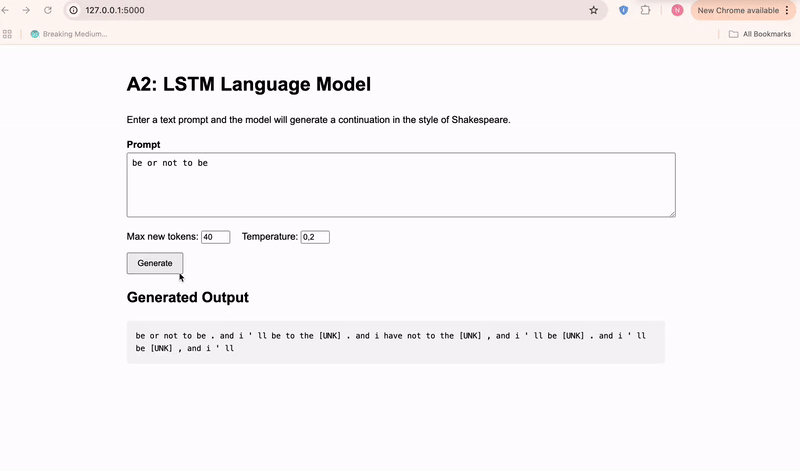

# A2: LSTM Language Model

This project implements a **word-level LSTM language model** trained on the **Tiny Shakespeare** dataset.  
The model predicts the next word in a sequence and generates Shakespeare-style text from a user prompt via a **Flask web app**.

---

## Dataset
- **Name:** Tiny Shakespeare  
- **Source:** https://github.com/karpathy/char-rnn  
- **Description:** Complete works of William Shakespeare in plain text, commonly used for language modeling.

---

## Methodology

### Preprocessing
- Remove empty lines  
- Tokenize using a **basic_english-style** tokenizer  
- Append `<eos>` to mark sentence endings  
- Build vocabulary from **training split only** (avoid data leakage)  
- Convert tokens to integer IDs

### Model Architecture
- Embedding layer  
- 2-layer LSTM  
- Linear output layer over vocabulary

### Training
- Objective: next-token prediction  
- Loss: CrossEntropyLoss  
- Evaluation: Perplexity  
- Gradient clipping for stability

---

## Web Application
A simple Flask app allows interactive text generation.

**How it works:**
1. User enters a prompt  
2. Prompt is tokenized and converted to token IDs  
3. LSTM generates a continuation  
4. Output is decoded back into text and displayed in the browser  

---

## How to Run

### 1) Train the model
Run all cells in `Task1.ipynb` to save:
- `model/lstm_lm.pt`
- `model/vocab_lm.pkl`

### 2) Run the web app
```bash
cd app
pip install -r requirements.txt
python app.py

Project Structure
Assignment_2/
├── Task1.ipynb
├── model/
│   ├── lstm_lm.pt
│   └── vocab_lm.pkl
├── app/
│   ├── app.py
│   ├── requirements.txt
│   └── templates/
│       └── index.html
├── screenshots/
│   └── app_demo.png
└── README.md

Example Output
